# Titulna strana

# Obsah

# Uvedenie do problematiky

## Zadanie
Za ulohu som mal vytvorit program p2pnprobe, ktory bude extrahovat informacie o tokoch z PCAP suboru. Tieto toky bude odosielat na kolektor vo formate NetFlow v5. 

Program prijma rozne argumenty, pomocou ktorych sa da nastavit, ako budu toky agregovane a kam ich bude odosielat (viz #Navod na pouzitie). 

Program bude na vstupe citat pakety z PCAP suboru zadaneho ako argument programu a tie spracuje a agreguje do tokov. Toky potom pomocou protokolu UDP odosle na NetFlow v5 kolektor, kde su tieto toky dalej spracovane a analyzovane. Program p2nprobe je len exporter a je zamerany len na zaznamy o tokoch TCP.

## Zakladne informacie
NetFlow v5 protokol vyvinuty spolocnostou Cisco a sluzi na monitorovanie a analyzu sietoveho toku dat. Sluzi na zbieranie informacii o sietovej prevadzke a naslednu analyzu na ucely monitorovania, optimalizacie a bezpecnosti siete.

Toky su agregovane podla urcitych kriterii, ako su napriklad IP adresa odosielatela a prijimatela, porty, protokol a dalsie. Podla nich su prichadzajuce pakety jedinecne identifikovatelne a priradene do tokov. 

Tok moze byt ukonceny roznymi spospobmi. V program p2nprobe je tok ukonceny troma sposobmi: 
    - po uplynuti aktivneho timeoutu
    - po uplynuti neaktivny timeoutu

Aktivny timeout je casovy interval, po ktorom je tok ukonceny, aj ked do neho stale prichadzaju pakety.

Neaktivny timeout je casovy interval, po ktorom je tok ukonceny, ak do neho neprichadzaju ziadne pakety po nejaky cas.

Exporter ukocnene toky uchovava v pamati a po nazbierani maximalneho poctu tokov v pamati alebo precitani posledneho paketu zo suboru, ich odosle na kolektor. Odoslany UDP datagram obsahuje hlavicku a zaznamy, ktorych podla specifikacie od spolocnosti Cisco je v rozsahu 1-30.


# Navrh aplikacie
Program je rozdeleny do viacerych logickych casti, ktore vykonavaju urcite ulohy:
- Nacitanie argumentov programu a ich spracovanie - ArgParser
- Nacitanie paketov zo suboru o extrahovanie podstatnych informacii - PcapReader
- Sprava a agregacia tokov - FlowManager
- Odosielanie tokov na kolektor - Exporter

Program najprv spracuje vstupne argumenty a skontroluje ich validitu pomocou modulu ArgParser. Nasledne modul PcapReader nacita pakety zo suboru zadaneho pomocou agrumentu. Kazdy paket je spracovany a su z neho extrahovane informacie, ktore su potrebne na identifikaciu toku a informacie potrebne pre statistiky. Tieto informacie su poslane do modulu FlowManager, ktory z nich vytvori jedinecny kluc pomocou ktoreho identifikuje tok ak nejaky tok s tymto klucom existuje, alebo vytvori novy. Ak FlowManager vyhodnoti tok ako expirovany pomocou informacii z paketu alebo informacii od modulu PcapReader, ze precital posledny paket z PCAP suboru, je odoslany na kolektor pomocou modulu Exporter. 


# Popis implementacie
Nizsie je zobrazeny class diagram, ktory zobrazuje ako su jednotlive moduly programu p2nprobe implementovane a ako spolu komunikuju. 

## Diagram


## Implemetacia
Program p2nprobe je implementovany v jazyku C++ verzia C++17 a vyuziva kniznicu libpcap na citanie a spracovanie paketov. 

### Pouzite kniznice:

- **libpcap** - čítanie PCAP súborov a extrahovanie informácií z paketov
- **arpa/inet.h** - konverzia IP adries a portov medzi sieťovým a hostiteľským formátom
- **netinet/ip.h, netinet/tcp.h** - parsovanie sieťových hlavičiek
- **sys/socket.h** - odosielanie NetFlow záznamov na kolektor
- **unordered_map, vector, string** - ukladanie a správu tokov a záznamov
- **ctime, chrono** - práca s časovými značkami a meranie času
- **iostream, sstream** - formátovanie výstupu (sprava help, rozne chybove hlasky)
- **memory** - Smart pointre a správa pamäte

### Konkretne moduly 

#### ArgParser
Modul na nacitanie vstupnych argumentov programu, spracovanie a overenie, ci su argumenty validne. V pripade chyby alebo chybajucich povinnych argumentov vypise chybovu hlasku a ukazku, ako spustit program. Argument -h vypise "help" spravu, ktora informuje uzivatela o pouziti programu a jednotlivych argumentoch.

#### ErrorCodes
Definicie roznych chybovych hlasok, pre lepsie rozpoznavanie, aka chyba nastala.
Mozne chybove kody:
- 0 - Bez chyby
- 1 - Vnutorna chyba, napriklad chyba alokacie pamati
- 2 - Nespravne argumenty
- 3 - Chyba pri otvarani suboru
- 4 - Chyba pri citani paketu
- 5 - Paket obsahuje nevalidne informacie

Implementuje aj funkciu ExitWith pre konzistentné ukončenie programu, na zjednodušenie správy chybových stavov.

#### PcapReader
Trieda na čítanie paketov zo súboru a ich spracovanie. Poskytuje rozhranie pre extrakciu TCP paketov a základných informácií z paketov a tie ulozi do struktury NetFlowV5record. Konstruktor triedy PcapReader ma jeden parameter - cestu k PCAP suboru, ktory sa ma citat. Metoda `processPacket` nacita jeden packet a spracuje ho. Metoda `isTcpPacket` kontroluje, ci je dany paket TCP paket - ostatne pakety su ignorovane.

#### FlowManager
Hlavná trieda zodpovedná za správu a agregáciu tokov. Riesi komunikaciu medzi jedntolivymi triedami. Vytvara toky a kluce pre ne podla informacii z paketu. Pomcou tychto klucov potom vie identifikovat, ci tok uz existuje alebo nie. Ak tok existuje, prida paket do toku pomocou metody `add_or_update_flow`. Ak tok neexistuje, vytvori novy tok a prida paket do neho. Na efektivne vyhladavanie využíva kombinovanú dátovú štruktúru (hash mapa + linked list) pre efektívne vyhľadávanie a správu tokov. Hash mapa sluzi na rychle vyhladanie tokov pomocou kluca a linked list obsahuje odkazy do hashmapy, ale zaroven udrzuje poradie, v akom sa toky vytvorili. Toky, ktore expirovali neexportuje hned, ale "cacheuje" pomocou metody `cache_expired` a exportuje ich az ked je naplneny maximalny pocet tokov v pamati (30) alebo je precitany posledny paket zo suboru. Ma dve metody na exportovanie tokov na kolektor - `export_cached` a `export_remaining`. Prva metoda exportuje vsetky toky, ktore su ulozene v cache ked sa naplni kapacita, druha metoda exportuje vsetky toky, ked sa nacita posledny paket ale zaroven cache este nie je plna.

#### NetFlowV5Key
Implementácia unikátneho kľúča pre identifikáciu tokov. Kombinuje 5 kľúčových atributov: zdrojová/cieľová IP, porty a protokol pre jednoznačnú identifikáciu toku. Využíva preťaženie operátora `==` pre porovnávanie kľúčov a implementuje vytvorenie kluca (jednoducha konkatencia vsetkych atributov kluca) z udajov, ktore su mu dane pre použitie v hash mape.

#### Exporter
Modul pre formátovanie a export NetFlow záznamov na kolektor. Modul formatuje NetFlow záznamy (struktura NetFlowV5record) a NetFlow hlavicky (strukuta NetFlowV5header) podľa špecifikácie NetFlow v5 a odosiela ich na kolektor specifikovany v programovych argumentoch pomocou protokolu UDP. Okrem toho aj pocita pocet odoslanych paketov, kedze tento udaj je potrebny v hlavicke NetFlow zaznamu. Podporuje resolvovanie hostname na IP adresu pomocou funkcie `getaddrinfo` (kniznica `arpa/inet.h`).

#### Flow
Reprezentácia jednotlivého sieťového toku, ktorá zapuzdruje všetky potrebné informácie o toku a jeho štatistiky. Taktiez obsahuje metody na pridanie paketu do toku a kontrolu, či je tok expirovany bud pomocou aktivneho alebo neaktivneho timeoutu. Jeho konstruktor ma 2 parametre - kluc, podla ktoreho je dany flow identifikovatelny a prvy zaznam z paketu, ktory je pridany do toku.

#### Struktura NetFlowV5header
Struktura, ktora reprezentuje hlavicku NetFlow zaznamu. Obsahuje informacie uvedene v tabulke nizsie alebo v dokumentacii od spolocnosti Cisco:
https://www.cisco.com/c/en/us/td/docs/net_mgmt/netflow_collection_engine/3-6/user/guide/format.html#wp1006186

|------------------------------------------------------------------------------------------------|
| Offset | Field             | Popis                                                             |
|--------|-------------------|-------------------------------------------------------------------|
| 0-1    | version           | Číslo verzie formátu exportu NetFlow                              |
| 2-3    | count             | Počet tokov exportovaných v tomto pakete (1-30)                   |
| 4-7    | SysUptime         | Aktuálny čas v milisekundách od spustenia exporteru               |
| 8-11   | unix_secs         | Aktuálny počet sekúnd od 0000 UTC 1970                            |
| 12-15  | unix_nsecs        | Zvyškové nanosekundy od 0000 UTC 1970                             |
| 16-19  | flow_sequence     | Počítadlo sekvencie celkového počtu tokov                         |
| 20     | engine_type       | Typ engine-u na prepínanie tokov                                  |
| 21     | engine_id         | Číslo slotu engine-u na prepínanie tokov                          |
| 22-23  | sampling_interval | Prvé dva bity obsahujú režim vzorkovania; zvyšných 14 bitov obsahuje hodnotu intervalu vzorkovania

#### Struktura NetFlowV5record
Struktura, ktora reprezentuje zaznam NetFlow v5. Obsahuje informacie uvedene v tabulke nizsie alebo v dokumentacii od spolocnosti Cisco:
https://www.cisco.com/c/en/us/td/docs/net_mgmt/netflow_collection_engine/3-6/user/guide/format.html#wp1006186

|--------------------------------------------------------------------|
| Bajty |  Obsah   |                     Popis                       | 
|-------|----------|-------------------------------------------------|
| 0-3   | srcaddr  | Zdrojová IP adresa                                 
| 4-7   | dstaddr  | Cieľová IP adresa 
| 8-11  | nexthop  | IP adresa ďalšieho smerovača 
| 12-13 | input    | SNMP index vstupného rozhrania 
| 14-15 | output   | SNMP index výstupného rozhrania 
| 16-19 | dPkts    | Počet paketov v toku 
| 20-23 | dOctets  | Celkový počet bajtov vrstvy 3 
| 24-27 | First    | SysUptime na začiatku toku 
| 28-31 | Last     | SysUptime v čase prijatia posledného paketu toku 
| 32-33 | srcport  | Zdrojový port TCP/UDP alebo ekvivalent 
| 34-35 | dstport  | Cieľový port TCP/UDP alebo ekvivalent 
| 36    | pad1     | Nepoužité (nulové) bajty 
| 37    | tcp_flags| Kumulatívny OR TCP príznakov 
| 38    | prot     | Typ IP protokolu (napríklad TCP = 6; UDP = 17) 
| 39    | tos      | IP typ služby (ToS) 
| 40-41 | src_as   | Číslo autonómneho systému zdroja 
| 42-43 | dst_as   | Číslo autonómneho systému cieľa 
| 44    | src_mask | Bitová maska zdrojovej adresy 
| 45    | dst_mask | Bitová maska cieľovej adresy 
| 46-47 | pad2     | Nepoužité (nulové) bajty 

# Zakladne informacie o programe

# Navod na pouzitie
## Kompilacia programu
Program je mozne skompilovat pomocou Makefile. Pre kompilaciu programu je potrebne mat nainstalovane kniznice libpcap a g++ (verzia C++17). Prelozenie programu je mozne pomocou prikazu:
```
make
```

## Spustenie programu
Program je mozne spustit takto:
./p2nprobe <host>:<port> <pcap_file_path> [-a <active_timeout> -i <inactive_timeout>]

Kde:

- <pcap_file_path> - cesta k PCAP suboru, ktory sa ma citat
- <host> - IP adresa kolektora, kam sa maju odosielat toky
- <port> - port kolektora, kam sa maju odosielat toky
- -a <active_timeout> - aktivny timeout, po ktorom je tok ukonceny (defualtna hodnota 60 sekund)
- -i <inactive_timeout> - neaktivny timeout, po ktorom je tok ukonceny (defualtna hodnota 60 sekund)

Poradie parametrov je lubovolne.

Ukazka spustenia programu:

./p2nprobe  localhost:9995 pcap_file.pcap -a 5 -i 30

./p2nprobe 127.0.0.1:9995 pcap_file.pcap

Kedze p2nprobe je len exporter, je potrebne mat spusteny NetFlow kolektor, ktory bude prijimat toky. Napriklad pomocou programu nfcapd. Napriklad takto:
nfcapd -l . -p 9995

Nasledne je mozne sledovat toky pomocou programu nfdump. Napriklad takto:
nfdump -r nfcapd.202411052020


# Popis testovania aplikacie
Aplikaciu som testoval pomocu doporuceneho programu ako referenciu - softflowd. 
NetFlow toky som zachytaval pomocou programu nfcapd.
```
nfcapd -l . -p 9995        
```
V druhom terminali som potom spustil:
```
sudo softflowd -r netflow_capture1.pcap -n localhost:9995
```
Bohuzial, aktivny a neaktivny timeout v softflowd nefungoval, takze som mohol testoval len defaultne hodnoty.

Nasledne som toky analyzoval a porovnaval pomocou programu nfdump.
```
nfdump -r nfcapd.202411052100
```
Takto som ziskal referencny vystup. 
Tento postup som opakoval pre moj program p2nprobe.

Na porovnanie som si vytvoril python script, ktory porovnava vystupy od nfdump pre oba programy. 

Kedze nebolo mozne takto testovat aktivny a neaktivny timeout, tak som potom zachytaval pomocou vlastneho python scriptu `test_probe.py`, ktory vie vypisat vsetky udaje z NetFlow zaznamov ale aj porovnat s inym kolektorom, napriklad softflowd. 

# Vysledky testov

# Bibliografia
- https://cplusplus.com/reference/
- https://www.w3schools.com/cpp/cpp_oop.asp
- https://www.ibm.com/docs/en/npi/1.3.0?topic=versions-netflow-v5-formats
- https://www.cisco.com/c/en/us/td/docs/net_mgmt/netflow_collection_engine/3-6/user/guide/format.html
- https://www.tcpdump.org/pcap.html

how to read pcap file in cpp
- https://gist.github.com/voldemur/261b5bc42688b9cf425fbaedc2d5fcbe#file-pcap_reader-cpp

- https://man7.org/linux/man-pages/man3/inet_ntop.3.html
- https://man7.org/linux/man-pages/man3/getaddrinfo.3.html

virtual classes in cpp
- https://www.scaler.com/topics/virtual-base-class-in-cpp/

copy constuctor
- https://www.geeksforgeeks.org/copy-constructor-in-cpp/

- https://www.educative.io/answers/how-to-implement-udp-sockets-in-c

Softflowd:
- https://github.com/irino/softflowd/